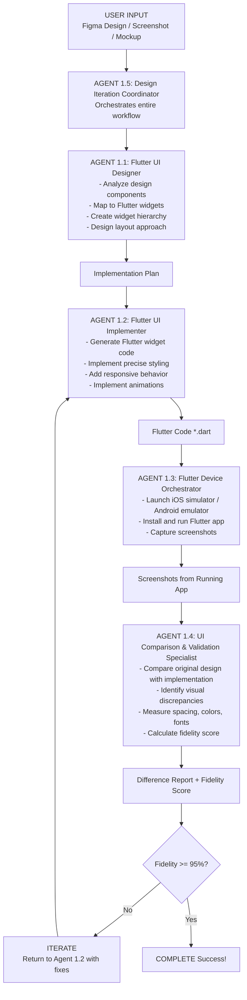
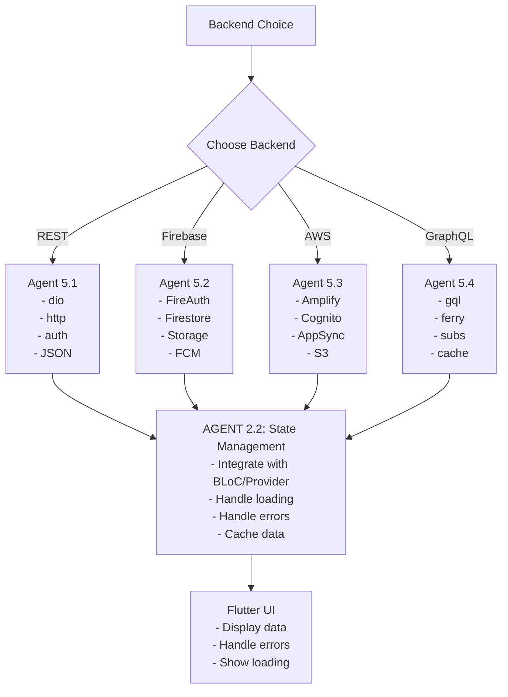
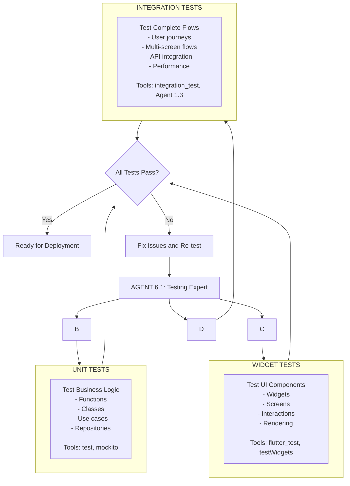
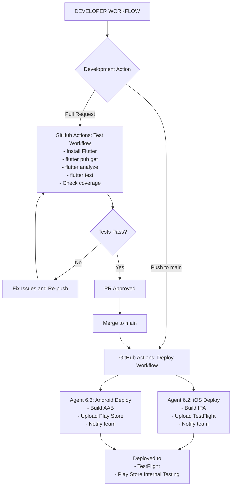
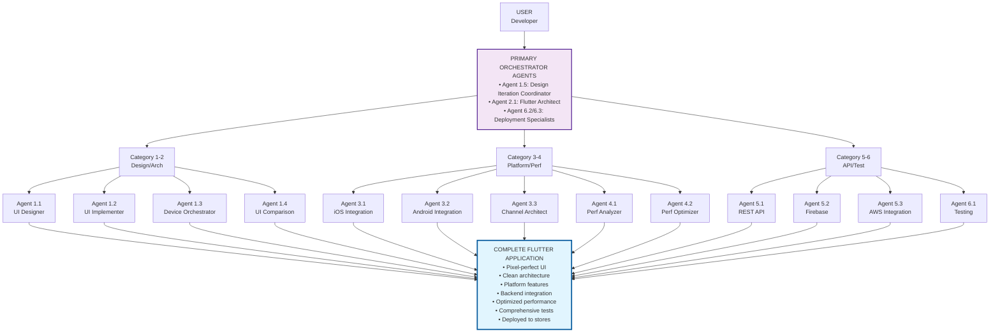
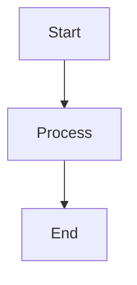

# Flutter Agent Ecosystem - Mermaid Workflow Diagrams

This document contains Mermaid diagrams that can be rendered on GitHub to visualize the Flutter agent ecosystem workflows.

---

## 1. Design-to-Implementation Workflow (Primary)



---

## 2. Complete Development Lifecycle

```mermaid
flowchart TD
    subgraph PHASE1 [PHASE 1: DESIGN]
        A1[Agents 1.1, 1.2, 1.3, 1.4, 1.5<br/>Output: Pixel-perfect UI implementation]
    end

    subgraph PHASE2 [PHASE 2: ARCHITECTURE]
        A2[Agent 2.1: Flutter Architect<br/>- Define project structure<br/>- Set up Clean Architecture<br/>- Configure dependency injection<br/>- Design navigation architecture]
        A3[Agent 2.2: State Management Specialist<br/>- Select state management solution<br/>- Implement Provider/BLoC/Riverpod<br/>- Design state flow]
    end

    subgraph PHASE3 [PHASE 3: PLATFORM INTEGRATION]
        A4[Agent 3.1: iOS Integration<br/>- Configure iOS project<br/>- Implement iOS-specific features<br/>- Set up Cupertino design]
        A5[Agent 3.2: Android Integration<br/>- Configure Android project<br/>- Implement Android-specific features<br/>- Set up Material Design]
        A6[Agent 3.3: Platform Channel Architect<br/>- Design platform channels<br/>- Implement native code bridges]
    end

    subgraph PHASE4 [PHASE 4: BACKEND INTEGRATION]
        A7[Agent 5.1: REST API Specialist<br/>- Implement HTTP client<br/>- Create API services<br/>- Handle authentication]
        A8[Agent 5.2: Firebase Expert<br/>- Set up Firebase<br/>- Implement Authentication<br/>- Integrate Firestore/Storage]
        A9[Agent 5.3: AWS Expert<br/>- Configure AWS Amplify<br/>- Integrate Cognito/AppSync<br/>- Set up S3/Lambda]
        A10[Agent 5.4: GraphQL Expert<br/>- Set up GraphQL client<br/>- Implement queries/mutations<br/>- Handle subscriptions]
    end

    subgraph PHASE5 [PHASE 5: PERFORMANCE OPTIMIZATION]
        A11[Agent 4.1: Performance Analyzer<br/>- Profile with DevTools<br/>- Identify bottlenecks<br/>- Generate optimization report]
        A12[Agent 4.2: Performance Optimizer<br/>- Implement optimizations<br/>- Optimize widget rebuilds<br/>- Optimize images and assets<br/>- Reduce jank and improve FPS]
    end

    subgraph PHASE6 [PHASE 6: QUALITY ASSURANCE]
        A13[Agent 6.1: Testing Expert<br/>- Write unit tests<br/>- Create widget tests<br/>- Implement integration tests<br/>- Set up golden tests]
        A14[Agent 1.3: Device Orchestrator<br/>- Test on multiple devices<br/>- Verify on different screen sizes]
    end

    subgraph PHASE7 [PHASE 7: DEPLOYMENT]
        subgraph PARALLEL [PARALLEL DEPLOYMENT]
            A15[Agent 6.2: iOS Deployment<br/>- Configure Xcode<br/>- Code signing<br/>- Build IPA<br/>- Upload TestFlight<br/>- App Store submit]
            A16[Agent 6.3: Android Deployment<br/>- Configure Gradle<br/>- App signing<br/>- Build AAB/APK<br/>- Upload Play Store<br/>- Release to users]
        end
    end

    PHASE1 --> PHASE2
    PHASE2 --> PHASE3
    PHASE3 --> PHASE4
    PHASE4 --> PHASE5
    PHASE5 --> PHASE6
    PHASE6 --> PARALLEL
    A15 --> DEPLOYED[DEPLOYED TO PRODUCTION]
    A16 --> DEPLOYED
```



---

## 3. Platform Channel Integration Workflow

```mermaid
flowchart TD
    A[NEED NATIVE FUNCTIONALITY<br/>Camera, Bluetooth, HealthKit, Payments, etc.] --> B[AGENT 3.3: Platform Channel Architect<br/>- Design channel architecture<br/>- Define method signatures<br/>- Create Dart service interface<br/>- Specify data contracts]
    B --> C[Dart Interface]
    C --> D
    C --> E

    D[AGENT 3.1: iOS Integration<br/>- Swift impl<br/>- iOS APIs<br/>- CocoaPods<br/>- Error handling]

    E[AGENT 3.2: Android Integration<br/>- Kotlin impl<br/>- Android APIs<br/>- Gradle deps<br/>- Error handling]

    D --> F[Platform Channels<br/>- MethodChannel<br/>- EventChannel<br/>- MessageCodec]
    E --> F
    F --> G[Flutter App (Dart)<br/>- Type-safe calls<br/>- Error handling<br/>- Async/await]
```

---

## 4. API Integration Workflow



---

## 5. Performance Optimization Workflow

```mermaid
flowchart TD
    A[PERFORMANCE ISSUE DETECTED<br/>Jank, slow loading, high memory] --> B[AGENT 4.1: Performance Analyzer]

    subgraph ANALYZE [Analysis Process]
        B1[Step 1: Profile with DevTools<br/>- Run app in profile mode<br/>- Open DevTools Performance view<br/>- Record performance timeline]
        B2[Step 2: Analyze Issues<br/>- Identify frames >16ms (jank)<br/>- Check for expensive builds<br/>- Analyze memory usage<br/>- Review widget rebuild frequency<br/>- Check image sizes]
        B3[Step 3: Generate Report<br/>- List issues by priority<br/>- Quantify impact<br/>- Suggest specific fixes]
    end

    B --> ANALYZE
    ANALYZE --> C[Performance Issue Report<br/>HIGH PRIORITY: Issue 1, Issue 2<br/>MEDIUM PRIORITY: Issue 3<br/>LOW PRIORITY: Issue 4]

    C --> D[AGENT 4.2: Performance Optimizer]

    subgraph OPTIMIZATIONS [Optimization Strategies]
        D1[Widget Rebuild Issues<br/>- Add const constructors<br/>- Use proper keys<br/>- Extract complex builds to methods<br/>- Use RepaintBoundary]
        D2[Image Optimization<br/>- Use cacheHeight/cacheWidth<br/>- Implement lazy loading<br/>- Add image placeholders<br/>- Compress images]
        D3[List Performance<br/>- Use ListView.builder<br/>- Implement virtualization<br/>- Add item extent hints<br/>- Use addAutomaticKeepAlive]
        D4[Animation Optimization<br/>- Use AnimatedBuilder<br/>- Minimize animated widget subtree<br/>- Use Transform instead of Positioned<br/>- Limit concurrent animations]
    end

    D --> OPTIMIZATIONS
    OPTIMIZATIONS --> E[Optimized Implementation]
    E --> F[Re-profile with Agent 4.1]
    F --> G{Performance Good?}
    G -->|Yes| H[COMPLETE]
    G -->|No| I[Iterate More<br/>Back to Agent 4.1]
    I --> B
```

---

## 6. Testing Workflow



---

## 7. CI/CD Workflow



---

## 8. Agent Orchestration Overview



---

## Usage Instructions

These Mermaid diagrams can be rendered on GitHub by:

1. **GitHub Markdown**: Paste any diagram code block directly into GitHub issues, pull requests, or README files
2. **GitHub Pages**: Use Mermaid.js library in your GitHub Pages site
3. **GitHub Mermaid Extension**: Install browser extensions that render Mermaid on GitHub

### Example GitHub Markdown Usage:

```markdown

```

The diagrams follow Mermaid syntax conventions and are optimized for GitHub's rendering capabilities. Each diagram represents a specific workflow in the Flutter agent ecosystem, showing the relationships and flow between different agents and processes.